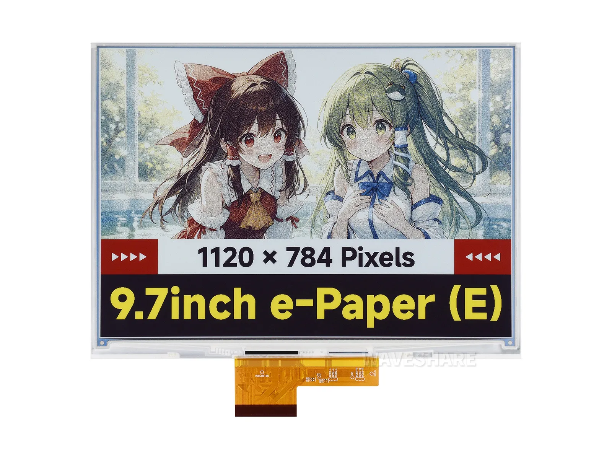

# Waveshare 9.7inch E-Paper (E) Product Engineering Sample Program

[中文](README_ZH.md)

The 9.7inch E-Paper (E) is a full-color e-ink screen with a resolution of 1120 × 784. It adopts the SPI communication interface and features low power consumption, wide viewing Angle and the ability to retain the last screen display content when power is off. The module version can be connected to main control boards such as Raspberry Pi, Arduino, STM32, ESP32, etc. through the SPI interface.

- [Purchase Link](https://www.waveshare.com/9.7inch-e-paper-e.htm)
- [Documentation](https://docs.waveshare.com/9.7inch_e-Paper_HAT%2B_%28E%29)



---

## Repository Structure

```text
9.7inch_e-Paper_E/
├── assets/                     # Product images
├── example/                    # Example programs
│   ├── Arduino_R4/             # Arduino UNO R4 example
│   ├── ESP32/                  # ESP32 example
│   ├── ESP32-S3/               # ESP32-S3 example
│   ├── RaspberryPi_JetsonNano/ # Raspberry Pi and Jetson Nano examples
│   └── STM32-F103ZET6/         # STM32 example
├── hardware/
│   └── schematics/             # Hardware schematics
├── LICENSE
├── README.md                   # English documentation
└── README_ZH.md                # Chinese documentation
```

---

## Configuration

You can find detailed configuration information on the product wiki page.

---

## Contributing

We welcome contributions! Here's how you can help:

1. Fork the repository.
2. Create a new branch for your feature or bug fix.
3. Commit your changes with clear descriptions.
4. Submit a pull request for review.

---

## Issues and Support

If you encounter any issues:

- Check the [Issues](https://github.com/waveshareteam/9.7inch_e-Paper_E/issues) section.
- Create a new issue with detailed information.
- Refer to the documentation for troubleshooting tips.
- Contact the Waveshare team and provide the order number to obtain technical support.

---

## License

This repository is licensed under the Apache License 2.0. See the [LICENSE](LICENSE) file for details.

---

Thank you for using Waveshare Electronics products!
